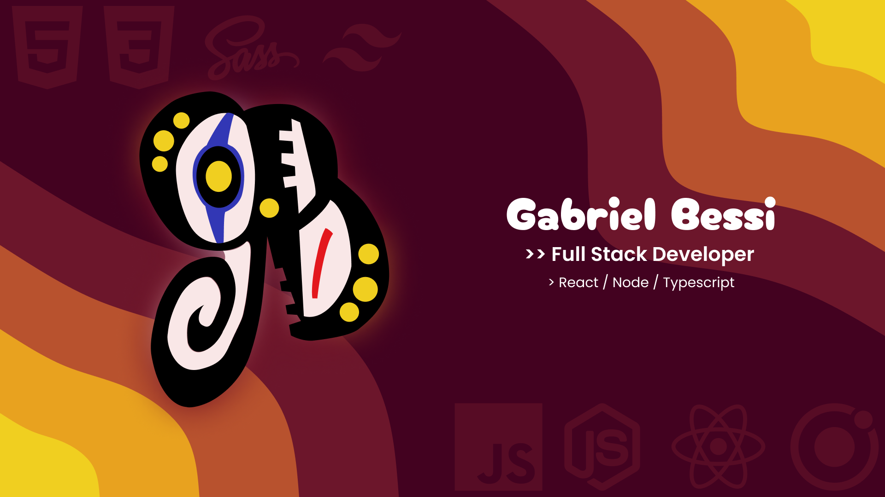

<h1 align="center"> Bessi Dev </h1>
<h2 align="center"> EzyRyder </h2>

Descubra as habilidades de um desenvolvedor freelancer apaixonado por transformar ideias em realidade. Aqui, você encontrará uma coleção diversificada de projetos que demonstram minha expertise em desenvolvimento web e aplicativos móveis. Estou disponível para novos trabalhos e ansioso por desafios criativos. Entre em contato para discutir suas necessidades e começar a criar hoje mesmo!

  <a href="#-tecnologias">Tecnologias</a>&nbsp;&nbsp;&nbsp;|&nbsp;&nbsp;&nbsp;
  <a href="#-projeto">Projeto</a>&nbsp;&nbsp;&nbsp;|&nbsp;&nbsp;&nbsp;
  <a href="#memo-licença">Licença</a>

  

  

## 🚀 Tecnologias

Esse projeto foi desenvolvido com as seguintes tecnologias:

- React
- Next 13
- TypeScript
- Framer-Motion
- Tailwindcss
- Zod
- react-hook-form

## 💻 Projeto
Esse é meu portfolio ele passou por tantas fazes e mudanças, e isso mostra o meu crescimento na carreira de desenvolvimento

- [version 1](https://eyzryder.github.io/)
- [version 2](https://bessiportfolio-c83b52drw-gabrielbessi.vercel.app) 
- [version latest](https://bessiportfolio.vercel.app) 

## :memo: Licença

Esse projeto está sob a licença MIT.

---

Feito com ♥ by Gabriel Bessi :wave: